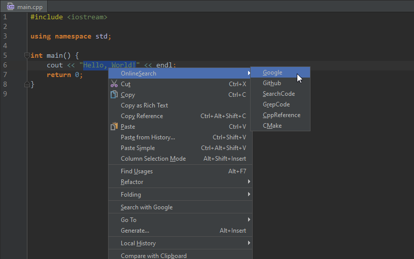
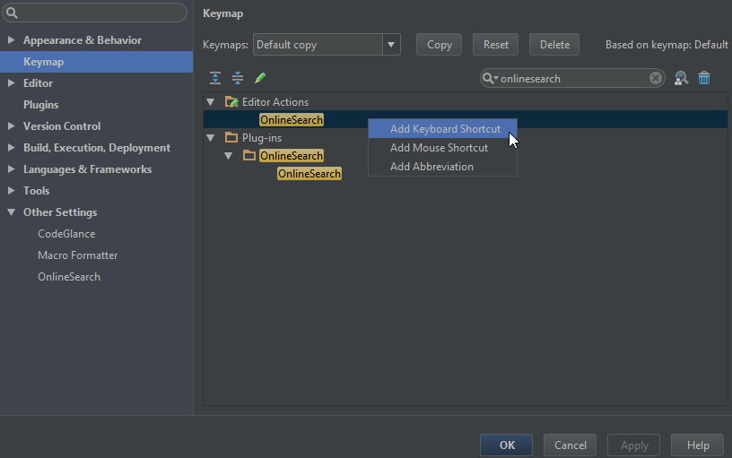
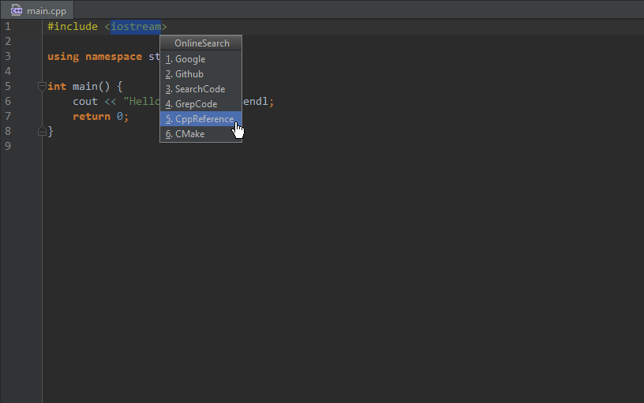
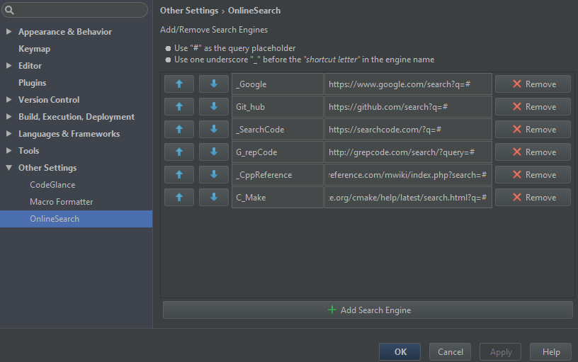
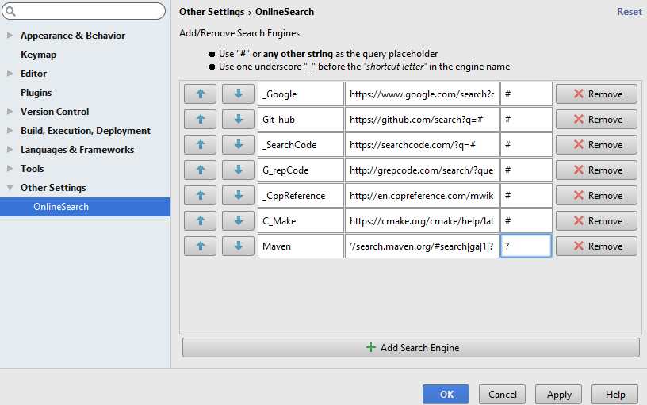
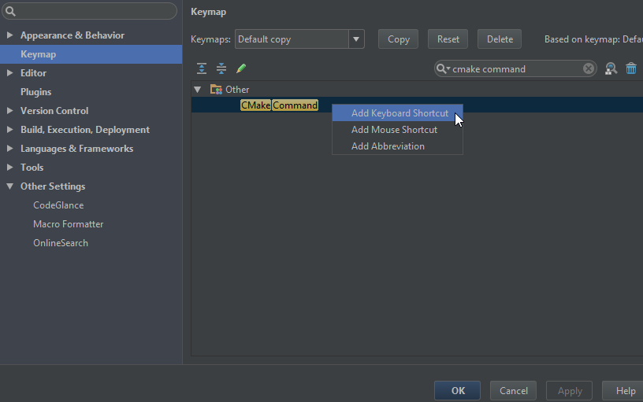
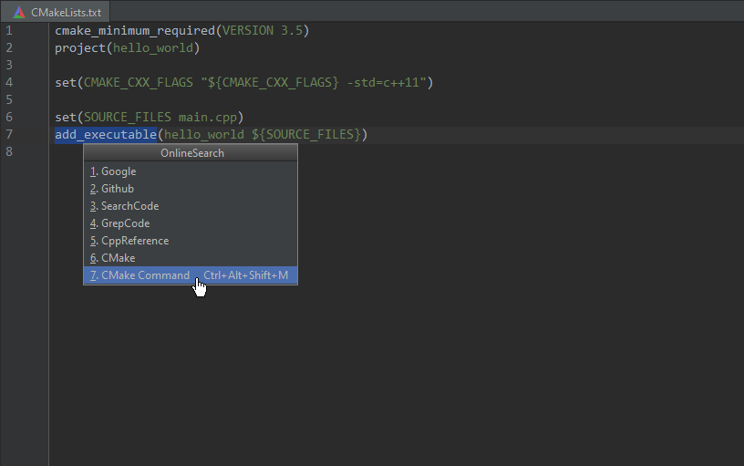
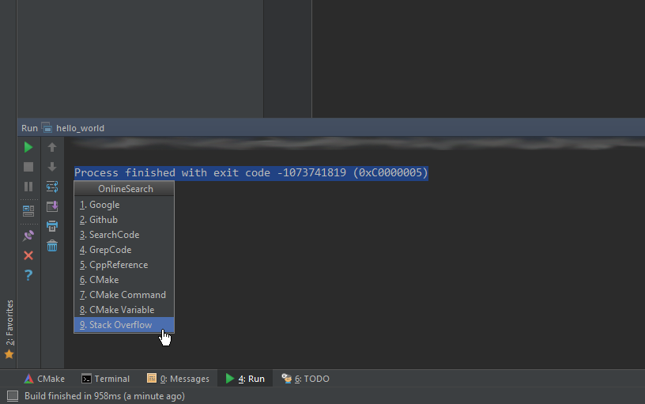

# OnlineSearch

[Download From Jetbrains' Plugin Repository](https://plugins.jetbrains.com/plugin/8298)

Search the selected text using <b>any</b> online search engine.

  <ul type="disc">
      <li>Compatible with all IntelliJ-based IDEs</li>
      <li>Add custom search engines' URLs in (Settings | Other settings | OnlineSearch)</li>
      <li>Launch the search from the editor's context menu (Select text | Right-click | OnlineSearch | Select a search engine)</li>
      <li>Map a search engine to a keyboard shortcut (Settings | Keymap | &lt;search engine name&gt;)</li>
      <li>Pop up the search engine list with a keyboard shortcut (Settings | Keymap | OnlineSearch)</li>
      <li>Works with other IDE "views" that have text areas (e.g. Diff, Debugger Console, Run Console, etc.)</li>
      <li>If you don't see the context menu entry, try a keyboard shortcut to show OnlineSearch's popup</li>
      <li>Out-of-the-box support for Google, Github, GrepCode, CppReference, and others (Ability to add/remove/reorder any number of search engines)</li>
  </ul>

Here are some typical use cases for OnlineSearch:

<figure>
    <figcaption align="center">Pre-defined search engines</figcaption>
     
    
</figure>

<figure>
    <figcaption align="center">Adding a shortcut to show OnlineSearch's popup menu</figcaption>
     
    
</figure>

<figure>
    <figcaption align="center">Popup menu</figcaption>
     
    
</figure>

<figure>
    <figcaption align="center">Settings</figcaption>
     
    
</figure>

<figure>
    <figcaption align="center">Adding a new search engine</figcaption>
     
    
</figure>

<figure>
    <figcaption align="center">Adding a shortcut to launch a particular search engine</figcaption>
     
    
</figure>

<figure>
    <figcaption align="center">Popup menu showing the new shortcut</figcaption>
     
    
</figure>

<figure>
    <figcaption align="center">Launch an online search from other text areas in the IDE</figcaption>
     
    
</figure>

